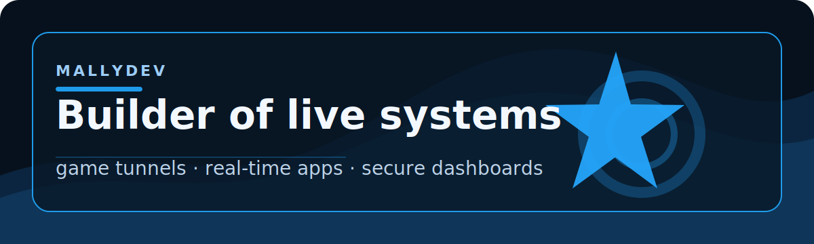

  

# MallyDev

I build tools that make self-hosting feel clean: game tunnels, real-time web apps, server dashboards, and desktop developer tools.

  
  
  

## Featured Work

| Project | Status | What it is |
|---------|--------|------------|
| [ArtemisGo](https://github.com/MallyDev2/ArtemisGo) | Active | Game tunnels and proxy tooling for self-hosted servers. |
| [Artemis Chess](https://chess.mallydev.xyz) | Active | Live chess with profiles, spectating, replays, and game history. |
| [Orion IDE](https://github.com/MallyDev2/orion-ide) | Active | Desktop code editor with project memory and assisted workflows. |

## What I Care About

- Secure tools that do not leak private infrastructure.
- Interfaces that feel polished, not thrown together.
- Real-time systems that keep state correctly across disconnects.
- Developer workflows that are fast to install and easy to trust.

## Stack

`TypeScript` · `Node.js` · `React` · `Electron` · `PostgreSQL` · `Docker` · `Linux` · `PowerShell`

## Contact

- Website: [mallydev.xyz](https://mallydev.xyz)
- Email: [malawarettv@gmail.com](mailto:malawarettv@gmail.com)
- Discord: [mallydev](https://discord.com/users/810271899170373732)
